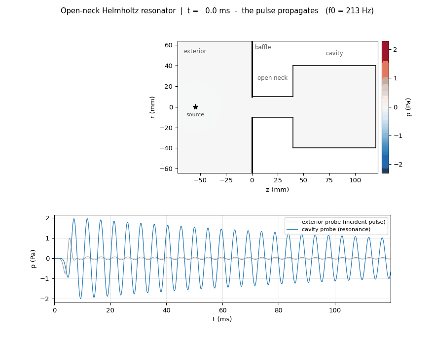
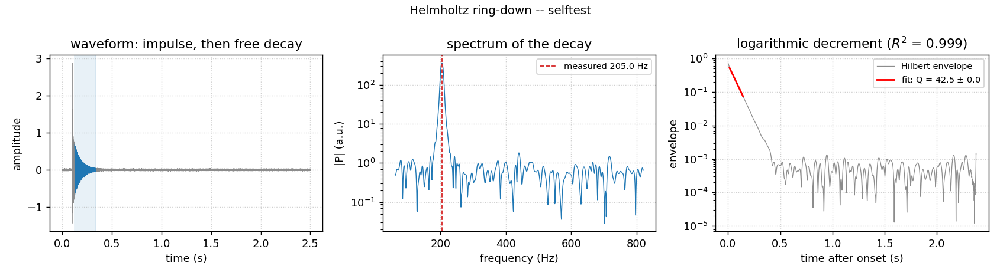

# Helmholtz resonator — a verified finite-difference study

A numerical study of an axisymmetric Helmholtz resonator, built around a rule the whole repository
follows: **no number is reported without the verification that bounds its error.** Two independent
finite-difference solvers are written, verified against manufactured solutions, converged on
successive grids, extrapolated to zero mesh size, cross-validated against each other and against
published measurements — and where they disagree, the disagreement is stated rather than averaged
away.

| # | Question | Method | Verified result |
|---|---|---|---|
| **1** | Where is the resonance, and what sets it? | harmonic FDM, `etude_helmholtz.ipynb` | full V&V: MMS order **2.03**, GCI **≈ 2 %**, validation against Selamet *et al.* to **0.9 % / 2.2 %** |
| **2** | What does the resonance look like **in real time**? | transient FDM with an open neck and a meshed exterior, `resonance_transitoire.ipynb` | **f₀ = 204.6 Hz** extrapolated (GCI 1.5 %), within **0.47 %** of the corrected formula |
| **3** | Does a real bottle agree? | ring-down measurement, `analyze_recording.py` | protocol and analysis chain in place and self-verified; awaiting a recording |



*The pulse propagates, enters through the neck, the cavity fills — then the pulse leaves and the
cavity **rings on its own** at its natural frequency. Part 2.*

## Getting started

```bash
pip install -r requirements.txt
jupyter lab etude_helmholtz.ipynb          # part 1 — harmonic FDM, V&V
jupyter lab resonance_transitoire.ipynb    # part 2 — transient resonance
python analyze_recording.py --self-test    # part 3 — verify the measurement chain
```

The notebooks ship **with their outputs**, so every figure is visible without running anything.

---

## Part 1 — Harmonic FDM: verification, validation, effective length

The complex pressure obeys the Helmholtz equation in axisymmetric cylindrical coordinates, with
the singularity at r = 0 removed by L'Hôpital's rule. Verification proceeds on three distinct
levels, in the order that makes each one meaningful:

| Level | Question | Method | Result |
|---|---|---|---|
| **Code** | is the scheme correctly programmed? | manufactured solution (MMS) | order **2.03** |
| **Solution** | is the mesh error bounded? | GCI convergence (Roache) + a 4th control grid | uncertainty **≈ 2 %** |
| **Model** | does it reproduce reality? | published measurements (Selamet *et al.*, 1997) | deviations **0.9 % / 2.2 %** |

- **Scaling law.** Once the numerical uncertainty is propagated, a power law and the
  effective-length model are statistically indistinguishable (ΔAICc not decisive). The physical
  model `f₀ = A_H/√(L+ΔL_eff)` is nevertheless preferred: **A_H ≈ 48** matches the theoretical
  constant, **ΔL_eff ≈ 0.67 R_neck** matches the Rayleigh–Ingard correction, and its
  leave-one-out prediction is ten times better. The apparent exponent *b ≈ −0.42* is an artefact
  of the restricted range of neck lengths.
- **End correction** decomposed into interior and exterior contributions through a radiation
  impedance condition — as a consistency test of the Robin implementation, not an *ab initio*
  calculation. Part 2 performs the *ab initio* version.
- **Losses** dominated by the neck boundary layer (**Q ≈ 47**); bulk absorption negligible.

## Part 2 — Transient resonance, open neck, meshed exterior

The neck is **genuinely open** onto a meshed exterior half-space (flat baffle, absorbing layers)
and excited by a **broadband pulse**. The resonator **selects** its own frequency: after the pulse
has passed, the cavity keeps oscillating. The exterior mesh **computes** the end correction
instead of postulating it — the first perspective of Part 1, now carried out.

| Quantity | Measured | Reference | Deviation |
|---|---|---|---|
| f₀ **extrapolated to zero mesh size** | **204.6 Hz** (GCI 1.5 %) | Helmholtz **with** end corrections: 205.6 Hz | **0.47 %** |
| — | — | Helmholtz **without** correction: 241.3 Hz | 15 % |
| Observed order of convergence | 0.86 | three grids: 2 / 1 / 0.5 mm | — |
| Q by radiation | **not measurable here** | varies by a factor of 6 with the boundary treatment | numerical artefact |

**A verification added afterwards, which corrected two announced results.** The solver places its
walls half a cell beyond the last node, so the geometry actually simulated is `R+h/2` and `H+h`,
biasing f₀ at first order. Three consequences:

- the raw frequency at h = 1 mm (209.8 Hz) appeared to coincide with the harmonic impedance
  calculation (209.84 Hz); that coincidence was **fortuitous**, an artefact of the mesh bias;
- once extrapolated, f₀ = **204.6 Hz**, within 0.47 % of the corrected theory — weaker agreement
  on its face, but this time **controlled** and carrying an uncertainty;
- f₀ is **perfectly robust** to the boundary treatment (0.00 % variation), whereas **Q varies by a
  factor of 6**: this calculation measures a natural frequency, not a damping.

Code verification: `mms_transient.py` (space-time manufactured solution, **order 1.98**), which
exercises the mask, the zero fluxes and the axis — none of which the Part 1 MMS covered.

### Full frequency sweep — `fdm_sweep.py`

A thousand harmonic solves from **1 to 1000 Hz in 77 seconds**, with a radiation impedance at the
mouth. Compare with the 7 to 17 hours an equivalent transient sweep would have cost: 10 s of
signal at `dt_CFL = 0.825 µs` is **1.21 × 10⁷ time steps**.

| Quantity | 1 Hz step | 0.005 Hz step |
|---|---|---|
| Resonance peak | 209.95 Hz | **209.84 Hz** |
| Amplitude at the peak | 6 622 Pa | **7 251 Pa** |
| −3 dB bandwidth | 0.96 Hz | 0.73 Hz |
| Quality factor Q | 218.6 | 285.6 |
| Gain over the 1 Hz sweep | **255×** | — |

> **The first pass underestimated the peak by 9 %.** The −3 dB bandwidth is 0.73 Hz, **narrower
> than the 1 Hz sampling step**: the peak was simply not resolved.


### Cross-validation of the two solvers

Both solvers were extrapolated to zero mesh size by Richardson's method.

| Quantity | Harmonic solver | Transient solver |
|---|---|---|
| Observed order | **0.933** | **0.863** |
| Extrapolated f₀ | **203.35 Hz** | **204.60 Hz** |
| GCI | 2.05 % | 1.54 % |
| Interval | 199.2 – 207.5 Hz | 201.4 – 207.8 Hz |

The two extrapolations differ by **0.61 %**, comfortably inside the uncertainty bars, and the
**corrected Helmholtz theory (205.56 Hz) falls inside both intervals**. Two independent solvers,
two different radiation models, one answer: a **controlled** cross-validation rather than a
fortunate one.

Both observed orders are near 0.9 rather than 2, because the half-cell bias is present in **both**
solvers. **Q, by contrast, differs by a factor of 2.7** between the radiation models — 285.6 from
the analytic impedance against 105 from the meshed exterior. This project measures a natural
frequency very well, and a damping badly.

### Animation of the established mode — `make_mode_anim.py`


*Quadrature measured at **+90.2°** between the neck velocity and the cavity pressure — the
signature of a mass-spring system: the plug of air in the neck is the mass, the air in the cavity
is the spring.*

## Part 3 — Closing the loop: measuring a real resonator

Everything above is computation. The one quantity the computation does not settle is the damping,
and the disagreement is not small: Q ≈ 286 from the analytic radiation impedance, anywhere from 44
to 267 from the meshed exterior depending on how the outer boundary is treated, against an
estimated Q ≈ 47 from viscothermal losses in the neck, which should dominate a real object.

[`docs/EXPERIMENTAL_PROTOCOL.md`](docs/EXPERIMENTAL_PROTOCOL.md) sets out a measurement that needs
a bottle, a phone and an afternoon, and [`analyze_recording.py`](analyze_recording.py) performs the
analysis: FFT with parabolic peak interpolation for f₀, then a band-pass, a Hilbert envelope and a
logarithmic decrement for Q — **the same estimator the transient solver uses**, so the measured and
computed values are directly comparable rather than merely similar.

The analysis chain is verified before any bottle is recorded:

```bash
python analyze_recording.py --self-test
```

| Self-test | What it checks | Result |
|---|---|---|
| Part 1 | recovery of f₀ and Q from synthetic ring-downs of known parameters, 128–480 Hz, 25–45 dB SNR | f₀ to **0.007 %**, Q to **4.4 %** worst case |
| Part 2 | the lumped predictions against this project's own reference geometry | f₀ to **0.06 %** of the corrected formula, Q_rad to **2.5 %** of the harmonic sweep |



*The self-test on a synthetic decay: the analysis window on the waveform, the spectrum, and the
log-envelope with its fit. Same three panels a real recording will produce.*

That second check is worth stating plainly: a lumped radiation resistance computed from the
geometry alone lands within 2.5 % of the 285.6 obtained by meshing the mouth and sweeping a
thousand frequencies. The two routes are independent.

## Reproducing

```bash
python fdm_open_resonator.py          # part 2: transient resonance (~6 min)
python fdm_sweep.py                   # frequency sweep, 1–1000 Hz (77 s)
python mms_transient.py               # code verification of the transient scheme (~10 s)
python convergence_f0.py              # mesh convergence and extrapolation of f0
python make_resonance_anim.py         # animation (after a run with OR_TAG=_anim, see the notebook)
python make_mode_anim.py              # animation of the established resonant mode (~30 s)
python analyze_recording.py --self-test   # part 3: verify the measurement chain
python make_paper_figures.py          # redraw the figures of the PDF from data/
```

## Contents

```
etude_helmholtz.ipynb            part 1 — harmonic FDM, V&V, effective length
resonance_transitoire.ipynb      part 2 — transient resonance (open neck)
fdm_open_resonator.py            transient solver, open neck + meshed exterior
fdm_sweep.py                     full frequency sweep with a radiation impedance
mms_transient.py                 code verification of the transient scheme (space-time MMS)
convergence_f0.py                mesh convergence of f0 + Richardson extrapolation
analyze_recording.py             part 3 — ring-down analysis of a real resonator
make_paper_figures.py            redraws the figures of the PDF from data/
make_resonance_anim.py           animation of the transient regime
make_mode_anim.py                animation of the established resonant mode
build_resonance_notebook.py      generator for the part 2 notebook
explication_scientifique.pdf     write-up of part 1
docs/EXPERIMENTAL_PROTOCOL.md    measurement protocol for a real resonator
data/  plots/                    data and figures
```

## What this study does and does not establish

**Established, with an error bar.** The natural frequency: two independent solvers, three levels of
verification, agreement with published measurements without a single fitted parameter, and a
theory that falls inside both uncertainty intervals.

**Not established.** The damping. Neither solver converges on Q, and the repository says so instead
of quoting a number. The exterior treatment — absorbing layers rather than a formal PML — is the
reason, and a formal PML with its own convergence study is the numerical fix. The experimental
route in Part 3 is the cheaper one, and it is the one that decides which of the computed values,
if any, describes a real object.

## References

Helmholtz (1860) · Rayleigh (1896) · Crandall (1926) · Ingard (1953) · Morse & Ingard (1968) ·
Bérenger (1994) · Roache (1994, 1998) · Selamet *et al.* (1997) · Peters *et al.* (2003) ·
Moloney (2004). Full entries in [`references.bib`](references.bib).
