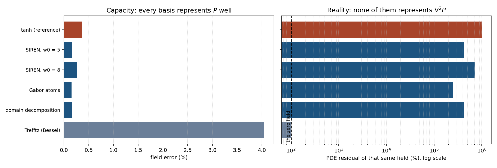
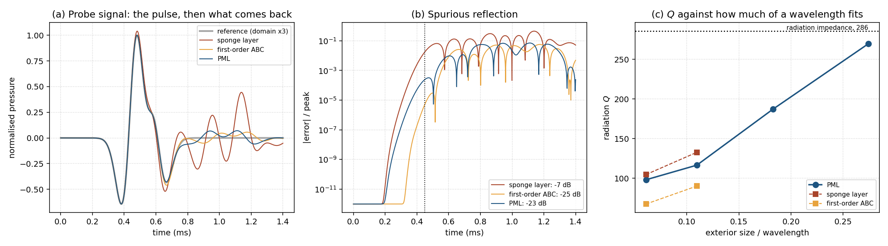

# Helmholtz resonator — a verified finite-difference study

A numerical study of an axisymmetric Helmholtz resonator, built around a rule the whole repository
follows: **no number is reported without the verification that bounds its error.** Two independent
finite-difference solvers are written, verified against manufactured solutions, converged on
successive grids, extrapolated to zero mesh size, cross-validated against each other and against
published measurements — and where they disagree, the disagreement is stated rather than averaged
away.

| # | Question | Method | Verified result |
|---|---|---|---|
| **1** | Where is the resonance, and what sets it? | harmonic FDM, `etude_helmholtz.ipynb` | full V&V: MMS order **2.03**, GCI **≈ 2 %**, validation against Selamet *et al.* to **0.9 % / 2.2 %** |
| **2** | What does the resonance look like **in real time**? | transient FDM with an open neck and a meshed exterior, `resonance_transitoire.ipynb` | **f₀ = 204.6 Hz** extrapolated (GCI 1.5 %), within **0.47 %** of the corrected formula |
| **3** | Does a real bottle agree? | ring-down measurement, `analyze_recording.py` | protocol and analysis chain in place and self-verified; awaiting a recording |
| **4** | Would a neural solver do better? | basis benchmark against the verified field, `bench_bases.py` | no: every family represents the field to 0.4 % and **none** represents its Laplacian |
| **5** | Why was the damping never converged? | sponge / ABC / PML compared, `pml_study.py` | the sponge reflects **44 %**; with a PML the two radiation models stop disagreeing |


*The pulse propagates, enters through the neck, the cavity fills — then the pulse leaves and the
cavity **rings on its own** at its natural frequency. Part 2.*

## Getting started

```bash
pip install -r requirements.txt
jupyter lab etude_helmholtz.ipynb          # part 1 — harmonic FDM, V&V
jupyter lab resonance_transitoire.ipynb    # part 2 — transient resonance
python analyze_recording.py --self-test    # part 3 — verify the measurement chain
```

The notebooks ship **with their outputs**, so every figure is visible without running anything.

---

## Part 1 — Harmonic FDM: verification, validation, effective length

The complex pressure obeys the Helmholtz equation in axisymmetric cylindrical coordinates, with
the singularity at r = 0 removed by L'Hôpital's rule. Verification proceeds on three distinct
levels, in the order that makes each one meaningful:

| Level | Question | Method | Result |
|---|---|---|---|
| **Code** | is the scheme correctly programmed? | manufactured solution (MMS) | order **2.03** |
| **Solution** | is the mesh error bounded? | GCI convergence (Roache) + a 4th control grid | uncertainty **≈ 2 %** |
| **Model** | does it reproduce reality? | published measurements (Selamet *et al.*, 1997) | deviations **0.9 % / 2.2 %** |

- **Scaling law.** Once the numerical uncertainty is propagated, a power law and the
  effective-length model are statistically indistinguishable (ΔAICc not decisive). The physical
  model `f₀ = A_H/√(L+ΔL_eff)` is nevertheless preferred: **A_H ≈ 48** matches the theoretical
  constant, **ΔL_eff ≈ 0.67 R_neck** matches the Rayleigh–Ingard correction, and its
  leave-one-out prediction is ten times better. The apparent exponent *b ≈ −0.42* is an artefact
  of the restricted range of neck lengths.
- **End correction** decomposed into interior and exterior contributions through a radiation
  impedance condition — as a consistency test of the Robin implementation, not an *ab initio*
  calculation. Part 2 performs the *ab initio* version.
- **Losses** dominated by the neck boundary layer (**Q ≈ 47**); bulk absorption negligible.

## Part 2 — Transient resonance, open neck, meshed exterior

The neck is **genuinely open** onto a meshed exterior half-space (flat baffle, absorbing layers)
and excited by a **broadband pulse**. The resonator **selects** its own frequency: after the pulse
has passed, the cavity keeps oscillating. The exterior mesh **computes** the end correction
instead of postulating it — the first perspective of Part 1, now carried out.

| Quantity | Measured | Reference | Deviation |
|---|---|---|---|
| f₀ **extrapolated to zero mesh size** | **204.6 Hz** (GCI 1.5 %) | Helmholtz **with** end corrections: 205.6 Hz | **0.47 %** |
| — | — | Helmholtz **without** correction: 241.3 Hz | 15 % |
| Observed order of convergence | 0.86 | three grids: 2 / 1 / 0.5 mm | — |
| Q by radiation | **not measurable with this termination** | varies by a factor of 6 with the boundary treatment | resolved in Part 5 |

**A verification added afterwards, which corrected two announced results.** The solver places its
walls half a cell beyond the last node, so the geometry actually simulated is `R+h/2` and `H+h`,
biasing f₀ at first order. Three consequences:

- the raw frequency at h = 1 mm (209.8 Hz) appeared to coincide with the harmonic impedance
  calculation (209.84 Hz); that coincidence was **fortuitous**, an artefact of the mesh bias;
- once extrapolated, f₀ = **204.6 Hz**, within 0.47 % of the corrected theory — weaker agreement
  on its face, but this time **controlled** and carrying an uncertainty;
- f₀ is **perfectly robust** to the boundary treatment (0.00 % variation), whereas **Q varies by a
  factor of 6**: with these absorbing layers the calculation measures a natural frequency, not a
  damping. Part 5 finds the cause and removes it.

Code verification: `mms_transient.py` (space-time manufactured solution, **order 1.98**), which
exercises the mask, the zero fluxes and the axis — none of which the Part 1 MMS covered.

### Full frequency sweep — `fdm_sweep.py`

A thousand harmonic solves from **1 to 1000 Hz in 77 seconds**, with a radiation impedance at the
mouth. Compare with the 7 to 17 hours an equivalent transient sweep would have cost: 10 s of
signal at `dt_CFL = 0.825 µs` is **1.21 × 10⁷ time steps**.

| Quantity | 1 Hz step | 0.005 Hz step |
|---|---|---|
| Resonance peak | 209.95 Hz | **209.84 Hz** |
| Amplitude at the peak | 6 622 Pa | **7 251 Pa** |
| −3 dB bandwidth | 0.96 Hz | 0.73 Hz |
| Quality factor Q | 218.6 | 285.6 |
| Gain over the 1 Hz sweep | **255×** | — |

> **The first pass underestimated the peak by 9 %.** The −3 dB bandwidth is 0.73 Hz, **narrower
> than the 1 Hz sampling step**: the peak was simply not resolved.


### Cross-validation of the two solvers

Both solvers were extrapolated to zero mesh size by Richardson's method.

| Quantity | Harmonic solver | Transient solver |
|---|---|---|
| Observed order | **0.933** | **0.863** |
| Extrapolated f₀ | **203.35 Hz** | **204.60 Hz** |
| GCI | 2.05 % | 1.54 % |
| Interval | 199.2 – 207.5 Hz | 201.4 – 207.8 Hz |

The two extrapolations differ by **0.61 %**, comfortably inside the uncertainty bars, and the
**corrected Helmholtz theory (205.56 Hz) falls inside both intervals**. Two independent solvers,
two different radiation models, one answer: a **controlled** cross-validation rather than a
fortunate one.

Both observed orders are near 0.9 rather than 2, because the half-cell bias is present in **both**
solvers. **Q, by contrast, appeared to differ by a factor of 2.7** between the radiation models —
285.6 from the analytic impedance against 105 from the meshed exterior. That disagreement turned
out to be numerical, not physical, and Part 5 takes it apart.

### Animation of the established mode — `make_mode_anim.py`


*Quadrature measured at **+90.2°** between the neck velocity and the cavity pressure — the
signature of a mass-spring system: the plug of air in the neck is the mass, the air in the cavity
is the spring.*

## Part 3 — Closing the loop: measuring a real resonator

Everything above is computation. Part 5 reconciles the two computed radiation Q's with each other,
but both describe radiation alone — and a real resonator is dominated by something neither solver
resolves: viscothermal friction in the neck, estimated at Q ≈ 47 against a radiation Q near 286.
A real bottle should therefore ring at Q ≈ 40, and only a measurement can confirm that.

[`docs/EXPERIMENTAL_PROTOCOL.md`](docs/EXPERIMENTAL_PROTOCOL.md) sets out a measurement that needs
a bottle, a phone and an afternoon, and [`analyze_recording.py`](analyze_recording.py) performs the
analysis: FFT with parabolic peak interpolation for f₀, then a band-pass, a Hilbert envelope and a
logarithmic decrement for Q — **the same estimator the transient solver uses**, so the measured and
computed values are directly comparable rather than merely similar.

The analysis chain is verified before any bottle is recorded:

```bash
python analyze_recording.py --self-test
```

| Self-test | What it checks | Result |
|---|---|---|
| Part 1 | recovery of f₀ and Q from synthetic ring-downs of known parameters, 128–480 Hz, 25–45 dB SNR | f₀ to **0.007 %**, Q to **4.4 %** worst case |
| Part 2 | the lumped predictions against this project's own reference geometry | f₀ to **0.06 %** of the corrected formula, Q_rad to **2.5 %** of the harmonic sweep |


*The self-test on a synthetic decay: the analysis window on the waveform, the spectrum, and the
log-envelope with its fit. Same three panels a real recording will produce.*

That second check is worth stating plainly: a lumped radiation resistance computed from the
geometry alone lands within 2.5 % of the 285.6 obtained by meshing the mouth and sweeping a
thousand frequencies. The two routes are independent.

## Part 4 — Why neural PDE solvers fail here, measured

Physics-informed networks are the obvious thing to try on a Helmholtz problem, and the usual
diagnosis when they underperform is spectral bias, with a better basis as the remedy: Fourier
features, SIREN, Gabor atoms, domain decomposition. Having a *verified* reference makes it
possible to test that diagnosis instead of assuming it.

`bench_bases.py` measures two things for each family, at random initialisation, **without any
training at all**:

- the best possible least-squares fit of the FDM field onto the basis — can it represent P?
- the PDE residual **of that same best-possible field** — does it satisfy the equation?

| basis | field error | residual of that same field | κ(A_phys) |
|---|---|---|---|
| tanh (reference) | 0.36 % | 997 875 % | 6.8·10¹³ |
| SIREN, ω₀ = 5 | 0.16 % | 427 910 % | 1.1·10⁴ |
| SIREN, ω₀ = 8 | 0.26 % | 711 862 % | **5.1·10²** |
| Gabor atoms | **0.15 %** | **253 570 %** | 2.3·10⁴ |
| domain decomposition | 0.16 % | 425 392 % | 3.9·10³ |
| Trefftz (Bessel) | 4.04 % | 100 % | 0 |

**100 % is exactly as bad as writing down the zero field.** Every neural family represents the
field to better than 0.4 % and every one of them leaves a residual in the hundreds of thousands of
percent. The best, Gabor, is still 2 536 times worse than zero.



The obstacle is not capacity. In this geometry the Laplacian amplifies a representation error by
**1/L² = 625**, and the true solution lives on a near-cancellation — ∇²P and −k²P are both enormous
and their difference is small. Representing P to 0.15 % is nowhere near enough to represent ∇²P.

What the basis *does* change is the conditioning of the system actually solved: eleven orders of
magnitude between tanh and SIREN ω₀ = 8. That is a real result, and a real reason to prefer sine
activations. It is simply not the binding constraint.

Trefftz is the exception that proves the point. Its functions satisfy ∇²φ + k²φ = 0 exactly, so
A_phys is identically zero: it cannot misrepresent the operator because it never approximates it —
and for the same reason it cannot carry the source, which is why it sits at exactly 100 %. A
Trefftz method needs a particular solution supplied separately.

Two minutes on a CPU, no training, no checkpoints. The measurement is the deliverable.

## Part 5 — The damping, and why it was never converged

The sections above state twice that the radiation Q is not trustworthy: it moves by a factor of six
with purely numerical settings, and the meshed exterior disagrees with the analytic radiation
impedance by a factor of 2.7. `pml_study.py` implements three outer-boundary treatments in one
solver and measures them, rather than arguing about them.

**How much does each one reflect?** A pulse is fired into a homogeneous exterior and compared
against the same run on a domain four times larger, where nothing can return within the window. The
difference *is* the reflection, so no analytic reference is needed.

| termination | spurious reflection |
|---|---|
| sponge layer (what the solver used) | **44 %** (−7 dB) |
| first-order ABC (Mur) | 5.6 % (−25 dB) |
| PML, same σ as the sponge | 7.1 % (−23 dB) |
| **PML, σ tuned** | **4.0 %** (−28 dB) |

The sponge sends back nearly half the incident amplitude. That single number explains the factor of
six.

On this test the first-order ABC beats an untuned PML, which is not surprising: the source sits on
the axis, so the wavefront meets the outer boundary close to normal incidence, and Mur is exact at
normal incidence. It is the resonator run below, where the field arrives from every angle, that
separates them.

**The PML floors at −28 dB, and the reason is geometric, not a bug.** Running each wall in isolation
separates them:

| boundary | PML reflection |
|---|---|
| flat (z), where the Cartesian complex stretch is exact | **0.093 %** (−61 dB) |
| curved (r), where the 1/r term is omitted | 4.03 % (−28 dB) |

A factor of 43. On a plane the implementation reaches the −61 dB expected of a textbook PML; the
floor is entirely the cost of applying a Cartesian stretch to a cylindrical surface. A genuinely
cylindrical PML is the fix, and this measurement is what says so.

**Does the resonator's Q then settle?** Only the PML holds still:

| termination | Q at Z_ext = 10 cm | at 18 cm | drift |
|---|---|---|---|
| sponge | 104.7 | 132.8 | +26.8 % |
| first-order ABC | 67.5 | 90.2 | +33.5 % |
| **PML** | 98.1 | 96.4 | **−1.8 %** |

f₀ moves by at most 0.14 % for any of them — the same lesson as everywhere else in this project.

*(The sponge run at 10 cm returns f₀ = 209.25 Hz and Q = 104.7, reproducing the verified solver of
Part 2 to the hundredth of a hertz. The two codes agree.)*

**But "settled between 10 and 18 cm" is not "converged".** At 209 Hz the wavelength is 1.64 m, so a
10 cm exterior is 0.06 of one: the PML sits deep in the reactive near field of the mouth and
truncates evanescent content a free half-space would keep. Enlarging it properly:

| exterior | in wavelengths | f₀ (Hz) | radiation Q |
|---|---|---|---|
| 10 cm | 0.061 | 208.32 | 98.1 |
| 18 cm | 0.110 | 208.42 | 116.6 |
| 30 cm | 0.183 | 208.53 | 187.2 |
| **45 cm** | **0.274** | 208.49 | **269.6** |



Q climbs from 98 to 270 and heads straight for the **285.6** of the analytic radiation impedance —
and for the 292.7 of the lumped baffled-piston formula, which agree with each other to 2.5 %. The
factor-2.7 disagreement this project reported was never physics. It was a domain one sixteenth of a
wavelength across.

Meanwhile f₀ stays within 0.1 % across a 4.5-fold enlargement. Frequency robust, damping demanding:
the same conclusion as everywhere, now with the reason attached.

**What is still open.** The largest run is 0.27 wavelengths and Q is at 270 against 286. The trend is
consistent with converging there; it is not a demonstration that it does. Showing it would need an
exterior around half a wavelength, which at this mesh is several hours of CPU — and it would settle
a quantity that is in any case three times smaller than the viscothermal losses of a real neck.
Part 3 is the cheaper arbiter.

## Reproducing

```bash
python fdm_open_resonator.py          # part 2: transient resonance (~6 min)
python fdm_sweep.py                   # frequency sweep, 1–1000 Hz (77 s)
python mms_transient.py               # code verification of the transient scheme (~10 s)
python convergence_f0.py              # mesh convergence and extrapolation of f0
python make_resonance_anim.py         # animation (after a run with OR_TAG=_anim, see the notebook)
python make_mode_anim.py              # animation of the established resonant mode (~30 s)
python analyze_recording.py --self-test   # part 3: verify the measurement chain
python bench_bases.py                 # part 4: neural bases, no training (~2 min)
python pml_study.py                   # part 5: sponge vs ABC vs PML (long; PML_SKIP_C=1 for the short form)
python make_paper_figures.py          # redraw the figures of the PDF from data/
```

## Contents

```
etude_helmholtz.ipynb            part 1 — harmonic FDM, V&V, effective length
resonance_transitoire.ipynb      part 2 — transient resonance (open neck)
fdm_open_resonator.py            transient solver, open neck + meshed exterior
fdm_sweep.py                     full frequency sweep with a radiation impedance
mms_transient.py                 code verification of the transient scheme (space-time MMS)
convergence_f0.py                mesh convergence of f0 + Richardson extrapolation
analyze_recording.py             part 3 — ring-down analysis of a real resonator
bench_bases.py                   part 4 — neural bases measured against the reference
pml_study.py                     part 5 — outer-boundary treatments and the radiation Q
make_paper_figures.py            redraws the figures of the PDF from data/
make_resonance_anim.py           animation of the transient regime
make_mode_anim.py                animation of the established resonant mode
build_resonance_notebook.py      generator for the part 2 notebook
explication_scientifique.pdf     write-up of part 1
docs/EXPERIMENTAL_PROTOCOL.md    measurement protocol for a real resonator
data/  plots/                    data and figures
```

## What this study does and does not establish

**Established, with an error bar.** The natural frequency: two independent solvers, three levels of
verification, agreement with published measurements without a single fitted parameter, and a
theory that falls inside both uncertainty intervals.

**Established since, in Part 5.** The radiation damping, to the extent a computation can settle it.
The sponge layer reflected 44 % of the incident amplitude, which is what made Q move by a factor of
six; a PML removes that, and the meshed exterior then climbs to meet the analytic radiation
impedance as the domain grows in wavelengths. The two routes agree.

**Still not established.** That the climb has actually stopped. The largest exterior run is 0.27
wavelengths across and Q is at 270 against an analytic 286 — consistent with converging there, not
a demonstration of it. And the whole radiation question is secondary for a real object anyway,
since viscothermal losses in the neck are three times larger. That is what Part 3 is for.

## References

Helmholtz (1860) · Rayleigh (1896) · Crandall (1926) · Ingard (1953) · Morse & Ingard (1968) ·
Bérenger (1994) · Roache (1994, 1998) · Selamet *et al.* (1997) · Peters *et al.* (2003) ·
Moloney (2004). Full entries in [`references.bib`](references.bib).
