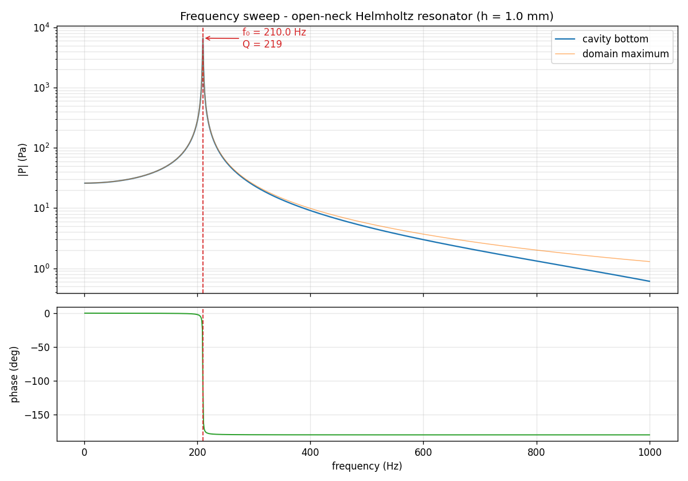
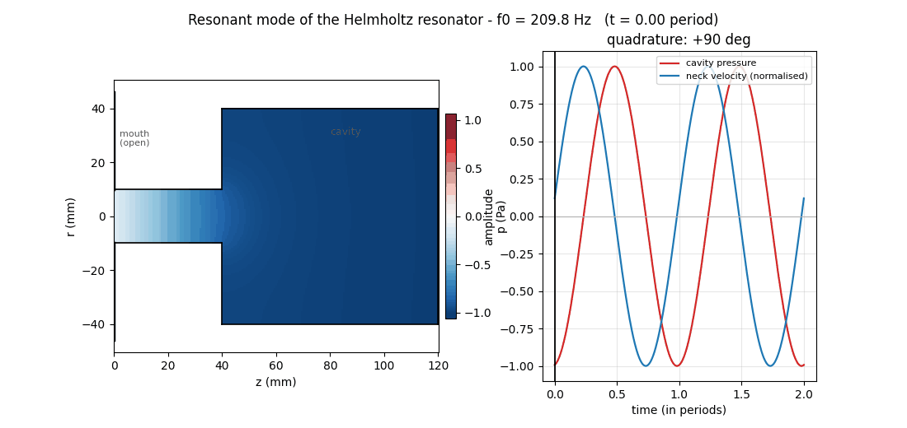

# Verified Finite-Difference Modelling of an Open Helmholtz Resonator

**Can a finite-difference model of an open Helmholtz resonator predict its natural frequency with
quantified numerical uncertainty?**

Two independent solvers, code verification by manufactured solutions, grid-convergence uncertainty,
and validation against published measurements.

```
                          HELMHOLTZ RESONATOR
                          axisymmetric geometry
                                    │
               ┌────────────────────┴────────────────────┐
               │                                         │
               ▼                                         ▼
       HARMONIC SOLVER                          TRANSIENT SOLVER
       ∇²p + k²p = −F                           ∂²p/∂t² = c²∇²p + F
       radiation impedance at the mouth         meshed exterior, open neck
               │                                         │
               ▼                                         ▼
       frequency sweep, 1–1000 Hz               broadband Ricker pulse
               │                                         │
               └────────────────────┬────────────────────┘
                                    │
                                    ▼
                         RESONANCE FREQUENCY
                              f₀ ≈ 204 Hz
                                    │
             ┌──────────────────────┼──────────────────────┐
             ▼                      ▼                      ▼
     CODE VERIFICATION      SOLUTION VERIFICATION    MODEL VALIDATION
     manufactured           Richardson + GCI         Selamet et al.
     solutions, p ≈ 2       uncertainty ≈ 2 %        published data
             └──────────────────────┼──────────────────────┘
                                    ▼
                            VERIFIED RESULT
                       204.6 Hz ± 1.5 %, two solvers
```


*A broadband pulse propagates, enters through the neck, the cavity fills — then the pulse leaves and
the cavity **rings on its own** at its natural frequency. No frequency is imposed anywhere.*

| | |
|---|---|
| **204.6 Hz** | extrapolated resonance frequency |
| **1.5 %** | grid-convergence uncertainty (GCI) |
| **0.61 %** | difference between two independent solvers |
| **0.9 – 2.2 %** | deviation from published measurements, no fitted parameter |

---

## The verification and validation ladder

This is the argument of the repository. Each rung answers a different question, and they only mean
something in this order.

| Stage | Question | Evidence |
|---|---|---|
| **Code verification** | Did I solve the PDE correctly? | manufactured solutions, observed order **2.03** (harmonic) and **1.98** (transient) |
| **Solution verification** | Is the mesh resolved enough? | Richardson extrapolation + GCI on three grids, plus a fourth control grid — uncertainty **≈ 2 %** |
| **Cross-validation** | Does an independent solver agree? | **203.35** vs **204.60 Hz**, uncertainty intervals overlapping |
| **Model validation** | Does it match reality? | Selamet *et al.* (1997), **0.9 %** and **2.2 %**, no adjusted parameter |

The corrected Helmholtz theory, 205.56 Hz, falls inside both solvers' intervals.

## Key numerical findings

**Mesh bias matters, and it hid behind a coincidence.** The solver places its walls half a cell
beyond the last node, so the geometry actually simulated is `R + h/2`: a first-order geometric
error. The raw frequency at h = 1 mm, 209.8 Hz, appeared to agree remarkably with the harmonic
calculation at 209.84 Hz. That agreement was an artefact of the bias. Extrapolated to zero mesh the
transient result is **204.6 Hz**, within 0.47 % of theory — a weaker-looking number that is this
time *controlled* and carries an uncertainty.

**Frequency is robust; damping is not.** f₀ moves by less than 0.14 % under any change of outer
boundary treatment, mesh size or absorbing layer. The radiation Q moved by a **factor of six** under
the same changes — until the cause was found: the absorbing layer reflected 44 % of the incident
amplitude. With a perfectly matched layer, Q settles.

**Two independent solvers agree.** A harmonic solver with an analytic radiation impedance and a
transient solver with a meshed exterior — different discretisations, different radiation models —
extrapolate to 203.35 and 204.60 Hz, differing by 0.61 %, well inside both uncertainty bars.

---

## 1 — The physical problem

A neck of length *L* and cross-section *S* = π*a*² on a rigid cavity of volume *V*: the plug of air
in the neck is the mass, the air in the cavity is the spring. The lossless lumped frequency, with an
end correction Δ*L* for the air that spills out at both ends, is

    f₀ = (c / 2π) · √( S / (V (L + ΔL)) )

The reference geometry is axisymmetric: neck radius 1 cm and length 4 cm, cavity radius 4 cm and
height 8 cm. Everything in this repository is a way of computing that frequency without assuming
Δ*L*, and of bounding the error on the answer.

## 2 — Numerical methods

Both solvers work on the meridian plane (r, z), where the term (1/r)·∂p/∂r is 0/0 on the axis;
L'Hôpital's rule turns it into ∂²p/∂r², so the Laplacian there is 2∂²p/∂r² + ∂²p/∂z².

**Harmonic** — [`src/harmonic_solver.py`](src/harmonic_solver.py). Sparse assembly of
∇²p + k²p = −F, rigid walls by folding the ghost node onto the diagonal, and a Robin condition at
the mouth carrying the low-frequency radiation impedance of a baffled piston. One complete linear
solve per frequency.

**Transient** — [`src/transient_solver.py`](src/transient_solver.py). Explicit leapfrog on the wave
equation, axisymmetric Laplacian in masked finite volumes, and a genuinely **open** neck onto a
meshed exterior half-space. Excited by a broadband Ricker pulse, so the resonator *selects* its own
frequency rather than being told one.

## 3 — Verification and validation

**Code verification.** On a smooth domain with a manufactured solution, the harmonic scheme converges
at order **2.03** over four grids. The transient scheme is verified separately by a space-time
manufactured solution at order **1.98** — and that test is what revealed the half-cell wall
convention, because matching the manufactured solution to the nominal geometry gives order 1 and
matching it to `R + h/2` restores order 2 with errors 27 times smaller.

**Solution verification.** f₀ on three grids (2 / 1 / 0.5 mm) for five neck lengths, with Richardson
extrapolation and Roache's GCI, plus a fourth control grid at 0.25 mm confirming the extrapolations
are stable to 0.2–0.4 %. Observed order ≈ 0.92, degraded towards 1 by the staircase geometry; the
numerical uncertainty is about 2 %.

**Model validation.** Two published configurations of Selamet *et al.* (1997) — a geometry four times
larger than the study's own — reproduced to **0.9 %** and **2.2 %** with no fitted parameter.

## 4 — Main physical results

**The end correction, computed rather than assumed.** The meshed exterior produces Δ*L* instead of
postulating it. Identified from the raw h = 1 mm frequency it comes out at 1.29 *a*, 15 % short of
the expected 1.51 *a* — and one might conclude the exterior mesh underestimates the radiation load.
Identified from the frequency extrapolated to zero mesh it is **1.56 *a***, within 3 %. The apparent
shortfall was the mesh bias, not physics.

**The scaling law.** Fitted on the extrapolated frequencies and weighted by the GCI, a power law and
the physical effective-length model are statistically indistinguishable (ΔAICc not decisive). The
physical model is preferred on three converging grounds: its constant A_H ≈ 48 matches theory, its
Δ*L*_eff ≈ 0.67 *a* matches Rayleigh–Ingard, and its leave-one-out prediction is ten times better.
The apparent exponent *b* ≈ −0.42 is an artefact of the restricted range of neck lengths.

**The sweep, and a peak that was not resolved.** A thousand harmonic solves from 1 to 1000 Hz take
77 seconds, against the 7 to 17 hours the same band would cost in the time domain. At a 1 Hz step
the peak read 209.95 Hz and 6 622 Pa; at 0.005 Hz it reads 209.84 Hz and **7 251 Pa**. The first
pass underestimated the peak by 9 %, because the −3 dB bandwidth is 0.73 Hz — *narrower than the
sampling step*.





*Quadrature measured at **+90.2°** between neck velocity and cavity pressure — the signature of a
mass-spring system.*

## 5 — Why the radiation damping is harder

Everything above concerns a frequency, and frequencies behave. The damping did not: it moved by a
factor of six with purely numerical settings. [`studies/radiation_boundaries.py`](studies/radiation_boundaries.py)
implements three outer-boundary treatments in one solver and measures them, comparing each against
the same run on a domain four times larger where nothing can reflect back in time.

| termination | spurious reflection | Q drift, 10 → 18 cm |
|---|---|---|
| sponge layer (what the solver used) | **44 %** | +26.8 % |
| first-order ABC (Mur) | 5.6 % | +33.5 % |
| **PML** | **4.0 %** | **−1.8 %** |

The sponge sends back nearly half the incident amplitude. That single number is the factor of six.

The PML floors at −28 dB, and running each wall alone shows why: **0.093 % (−61 dB) on the flat
boundary**, where the Cartesian complex stretch is exact, against **4.03 % (−28 dB) on the curved
one**, where the 1/r term is omitted. The implementation reaches textbook performance on a plane;
the floor is the cost of a Cartesian stretch on a cylinder.

**And holding still between 10 and 18 cm is not convergence.** At 209 Hz the wavelength is 1.64 m, so
a 10 cm exterior is 0.06 of one — the PML sits inside the reactive near field of the mouth.
Enlarging it properly:

| exterior | in wavelengths | radiation Q |
|---|---|---|
| 10 cm | 0.061 | 98.1 |
| 18 cm | 0.110 | 116.6 |
| 30 cm | 0.183 | 187.2 |
| **45 cm** | **0.274** | **269.6** |


Q climbs to meet the **285.6** of the analytic radiation impedance. The factor-2.7 disagreement this
project used to report between its two radiation models was never physics — it was a domain one
sixteenth of a wavelength across. Meanwhile f₀ stays within 0.1 % across a 4.5-fold enlargement.

*Still open:* the largest run is 0.27 wavelengths with Q at 270 against 286, which is consistent with
converging there but does not demonstrate it.

## 6 — Extensions and negative results

**Physical validation, pending a recording.** [`experiments/protocol.md`](experiments/protocol.md)
sets out a ring-down measurement needing a bottle, a phone and an afternoon, and
[`experiments/ringdown_analysis.py`](experiments/ringdown_analysis.py) performs the analysis — FFT
with parabolic peak interpolation for f₀, then a band-pass, Hilbert envelope and logarithmic
decrement for Q, *the same estimator the transient solver uses*. The chain is verified before any
bottle is recorded (`--self-test`): it recovers synthetic decays to 0.007 % on f₀ and 4.4 % on Q
across 128–480 Hz, and its lumped predictions land within 0.06 % of theory and 2.5 % of the harmonic
sweep. This matters because radiation is the *smaller* loss — the neck's viscothermal friction is
estimated at Q ≈ 47, three times stronger, and no solver here resolves it.

**Neural PDE solvers: a measured negative result.** Having a verified reference makes it possible to
test the usual claim — that physics-informed networks underperform on wave problems because of
spectral bias, curable with a better basis. [`studies/neural_basis_benchmark.py`](studies/neural_basis_benchmark.py)
measures, without any training, the best possible projection of the FDM field onto each basis *and*
the PDE residual of that same best-possible field. tanh, SIREN, Gabor atoms and domain decomposition
all represent the field to better than 0.4 %; all leave a residual in the hundreds of thousands of
percent, where 100 % is exactly as bad as the zero field. The best, Gabor, is 2 536 times worse than
writing down zero. The obstacle is not capacity: the Laplacian amplifies representation error by
1/L² = 625, and the solution lives on a near-cancellation between two large terms.


## 7 — Reproducing

```bash
pip install -r requirements.txt

jupyter lab notebooks/harmonic_study.ipynb      # the harmonic study, self-contained
jupyter lab notebooks/transient_study.ipynb     # the transient study

python src/transient_solver.py                  # transient resonance (~6 min)
python studies/frequency_sweep.py               # 1–1000 Hz sweep (77 s)
python verification/mms_transient.py            # code verification of the transient scheme
python verification/grid_convergence.py         # mesh convergence and extrapolation of f0
python experiments/ringdown_analysis.py --self-test
python studies/neural_basis_benchmark.py        # no training (~2 min)
python studies/radiation_boundaries.py          # long; PML_SKIP_C=1 for the short form
```

The notebooks ship **with their outputs**, so every figure is visible without running anything.

```
src/          the two solvers
verification/ manufactured solutions and grid convergence — why the code can be trusted
studies/      secondary questions: the sweep, the outer boundary, neural bases
experiments/  physical validation: protocol and ring-down analysis
notebooks/    the two studies, with outputs
tools/        figure and animation generation
paper/        the write-up, its sources and its bibliography
data/  figures/
```

## 8 — Paper

[`paper/paper.pdf`](paper/paper.pdf) — the full write-up of the harmonic study: formulation,
verification, validation, scaling law, decomposition of the end correction, and the loss model.
Rebuild it with `python tools/make_paper_figures.py` then `latexmk -pdf paper/paper.tex`.

**References.** Helmholtz (1860) · Rayleigh (1896) · Crandall (1926) · Ingard (1953) ·
Morse & Ingard (1968) · Bérenger (1994) · Roache (1994, 1998) · Selamet *et al.* (1997) ·
Peters *et al.* (2003) · Moloney (2004). Full entries in
[`paper/references.bib`](paper/references.bib).
